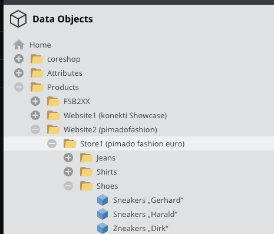

<h1>Index Sort Bundle</h1>

> Update the sorting of specific folders using the Pimcore Maintenance Cron

- [Setup](#setup)
  - [Install](#install)
  - [Uninstall](#uninstall)
  - [Configuration](#configuration)
    - [Example](#example)
- [Usage](#usage)

---

# Setup

## Install

Install with composer:

```
# Install module
composer config repositories.synoa_dataobjectsortindex git https://github.com/synoa/cerebro.pimcore.dataobjectsortindex.git
COMPOSER_MEMORY_LIMIT=-1 composer require synoa/apidataobjectsort

# Enable the extension and add the updated var/config/extensions.php into the repo
bin/console pimcore:bundle:enable DataObjectSortIndexBundle
```


## Uninstall

```
COMPOSER_MEMORY_LIMIT=-1 composer remove synoa/apidataobjectsort
composer config unset repositories.synoa_dataobjectsortindex
```

---

## Configuration

Add the following to a symfony config (eg. `app/config/config.yml`):


```yaml
data_object_sort_index:
    sort_index:
        products:
            folder: /full/path/to/the/parent-object
            object_class: <type of the object that should be sorted, e.g. product or category>
            data_object_field: <name of the field that should be used to save the sorting></name>
            type: alphabetic
```

### Example

In Pimcore you have a structure like this:



Now you want that all sub-objects in `/Products/Website2 (pimadofashion)/Store1 (pimado fashion euro)/Shoes` with the type `product` are sorted using the field `sorting` to store the value: 

```yaml
data_object_sort_index:
    sort_index:
        products:
            folder: /Products/Website2 (pimadofashion)/Store1 (pimado fashion euro)/Shoes
            object_class: product
            data_object_field: sorting
            type: alphabetic
```


---

# Usage

After the different paths are added via the config, the sorting happens automatially when the pimcore:maintenance job (usually triggered via the default Pimcore cron) es executed, which means that you should see your result after ~ 5 minutes. 