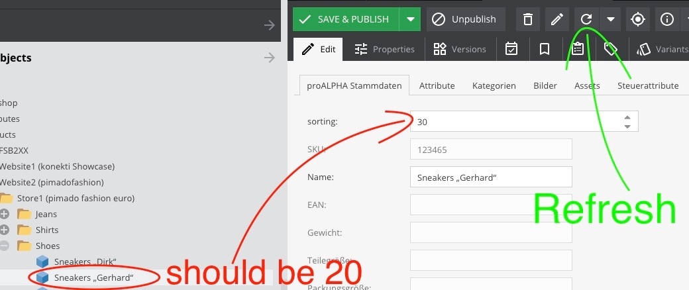

<h1>Index Sort Bundle</h1>

> Update the sorting of specific folders using the Pimcore Maintenance Cron

- [Setup](#setup)
  - [Install](#install)
  - [Uninstall](#uninstall)
  - [Configuration](#configuration)
    - [Example](#example)
- [Usage](#usage)
  - [Manual](#manual)
- [FAQ](#faq)
  - [Why is the sorting is not updated?](#why-is-the-sorting-is-not-updated)
    - [Did you change the `o_key`?](#did-you-change-the-o_key)
    - [Did you refresh the object?](#did-you-refresh-the-object)
    - [Is the `pimcore:maintenance` actually running?](#is-the-pimcoremaintenance-actually-running)

---

# Setup

## Install

Install with composer:

```
# Install module
composer config repositories.synoa_dataobjectsortindex git https://github.com/synoa/cerebro.pimcore.dataobjectsortindex.git
COMPOSER_MEMORY_LIMIT=-1 composer require synoa/apidataobjectsort

# Enable the extension and add the updated var/config/extensions.php into the repo
bin/console pimcore:bundle:enable DataObjectSortIndexBundle
```


## Uninstall

```
COMPOSER_MEMORY_LIMIT=-1 composer remove synoa/apidataobjectsort
composer config unset repositories.synoa_dataobjectsortindex
```

---

## Configuration

Add the following to a symfony config (eg. `app/config/config.yml`):


```yaml
data_object_sort_index:
    sort_index:
        products:
            folder: /full/path/to/the/parent-object
            object_class: <type of the object that should be sorted, e.g. product or category>
            data_object_field: <name of the field that should be used to save the sorting></name>
            type: alphabetic
```

### Example

In Pimcore you have a structure like this:


Now you want that all sub-objects in `/Products/Website2 (pimadofashion)/Store1 (pimado fashion euro)/Shoes` with the type `product` are sorted by their name (`o_key` in Pimcore, not the actual field `Name` of the Object) using the field `sorting` to store the value: 

```yaml
data_object_sort_index:
    sort_index:
        products:
            folder: /Products/Website2 (pimadofashion)/Store1 (pimado fashion euro)/Shoes
            object_class: product
            data_object_field: sorting
            type: alphabetic
```


---

# Usage

After the different paths are added via the config, the sorting happens automatially when the `pimcore:maintenance` job (usually triggered via the default Pimcore cron) is executed, which means that you should see your result after ~ 5 minutes. 

## Manual

You can also trigger the sorting manually: `bin/console synoa:data_object_sort_index:sort`


---

# FAQ

## Why is the sorting is not updated?

### Did you change the `o_key`? 

This is the name of the object in the list, NOT the field `Name` of the object when you edit the object.

You can change the `o_key` with right click on the object and in the context menu choose `rename`.

### Did you refresh the object? 

As when you had the object open before, refreshing the object-tree doesn't refresh the indiviual object




### Is the `pimcore:maintenance` actually running?

Go onto the server and open the list of cronjobs with `crontab -l` and see if this is added:

```
*/5 * * * * ~/pimcore/current/bin/console pimcore:maintenance
```

If not then it needs to be added. 